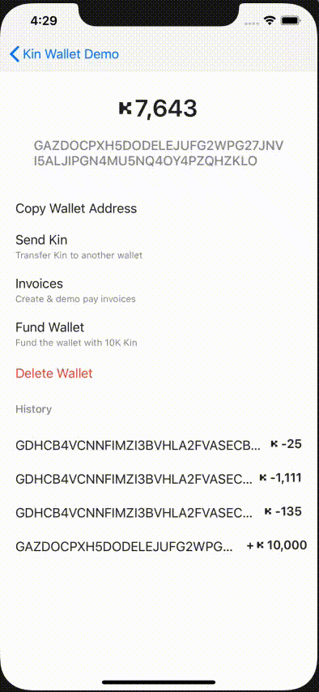

#  KinUX

The KinUX module provides an easy to use out of the box spend flow UI that is prescribed to be used to execute spend payments for digital goods and services with Kin in your app.

## Installation
Add the following to your project's Podfile.
This will also transitively pull in KinBase and KinDesign into your project as well.
```
pod 'KinUX', '~> 2.0.0'
```

##  Overview
The following video showcases how the Spend flow is used in the included [sample app](../KinSampleApp) that you can try out as a user or review the code on how the experience was achieved. The actual spend flow included in this module begins with the model flow when the 'Pay Now' button is tapped and you see the screen with 'Confirm' button. It then progresses to a 'Confirming' screen, before ultimately either showing 'Confirmed' or and error state. The Confirm screen shows your AppInfo that was configured in the `AppInfoProvider` (read more about in [base](../KinBase))and set to your KinEnvironment builder.




## How to Use
To show the spend flow, first create an Invoice according to the Invoices documentation in [base](../KinBase), and a `SpendNavigator` with the activity reference you plan on showing the spend flow from.
Then call `confirmPaymentOfInvoice` with your invoice and the valid `KinAccount.Id` corresponding to the `KinAccount` you plan on paying with. The possible failure reason's all have corresponding text that is shown the user in the event of these errors, but the reason is passed on to you as the caller to handle further if needed. e.g. redirect users to a place where they can get kin in the event they have an `INSUFFICIENT_BALANCE`, present the user with the option to go to your listing in the Google Play Store to check for updates of your app if you get `SDK_UPGRADE_REQUIRED`, etc.

*Note: This KinAccount must have been created or imported into this app so that a valid KinAccountContext can be created with it, otherwise you will end up with `UNKNOWN_PAYER_ACCOUNT`.*

```swift
// ... your view controller code ...
var paymentFlowController: PaymentFlowController?
var appInfoProvider: AppInfoProvider?
var kinAccountContext: KinAccountContext?
var invoice: Invoice?

override func viewDidLoad() {
  ...
  // Set up kinAccountContext and invoice
  kinAccountContext = try KinAccountContext
            .Builder(env: KinEnvironment.Agora.testNet())
            .importExistingPrivateKey(key)
            .build()
  invoice = try Invoice(lineItems: [LineItem(title: "Test Title",
                                             amount: Kin(100))])
}

@objc private func kinUXPaymentFlowTapped() {
  paymentFlowController = PaymentFlowController(kinAccountContext: kinAccountContext,
                                                hostViewController: self)

  paymentFlowController?.confirmPaymentOfInvoice(invoice,
                                                payerAccount: kinAccountContext.accountId,
                                                processingAppInfo: appInfoProvider.appInfo,
                                                onResult: { (result: PaymentFlowViewModelResult) in
      // Handle result
      swift result {
        case: .success(let hash):
          // Payment success
        case: .failure(let error):
          // Payment failed, check error.reason for `PaymentFlowFailureReason`
      }
 })
}
```
